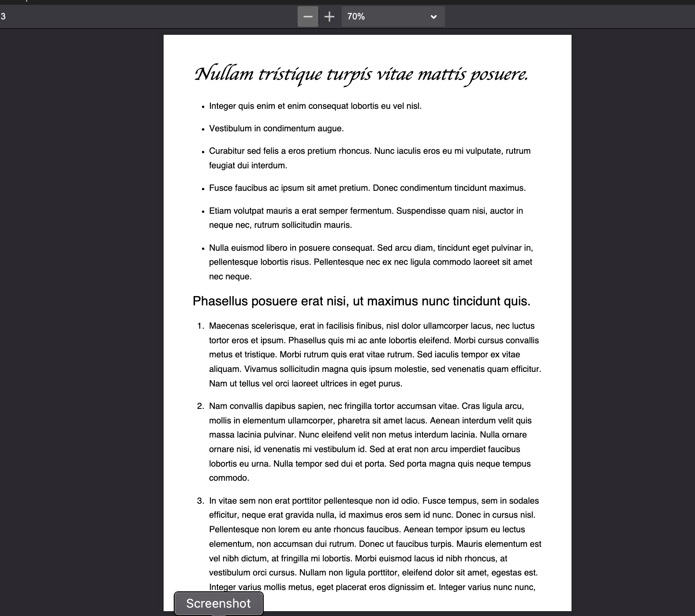

# Md_Converter Application

<br>

- The Md_Converter is a specialized Python application designed to streamline the process of converting Markdown (`.md`) files into PDF format. 

- This tool stands out for its ease of use, providing a graphical user interface (GUI) built with Tkinter, which allows users to input the path of a Markdown file and convert it effortlessly into a well-formatted PDF document. 

- This project aims to address the shortcomings of existing tools by ensuring high-quality conversions that maintain text selectability and styling fidelity in the output files. 

- This converter is not just a tool; it's a response to a real-world problem, offering a practical and user-friendly solution for developers and content creators alike.

- As a developer, I frequently encountered challenges with existing VSCode extensions for Markdown conversion. The primary issue was that these extensions often failed to convert Markdown files into PDFs with selectable text and proper styling tags. 

- By automating the conversion process, Md_Converter saves time and reduces the potential for manual errors, making document handling more efficient.

<br>


<br>

# Technologies Involoved : 

<div style="display:flex;justify-content:space-evenly;">
<div style="width:65px;">


</div>
<div style="width:25px;">


</div>
<div style="width:25px;">


</div>
</div>


<br>

<br>


- Md_Converter leverages the power of Python libraries such as `markdown_it` for parsing Markdown content and `pdfkit` for generating PDFs. 

- The application is structured into several key functions, each designed to handle specific aspects of the conversion process, from reading and processing Markdown files to rendering them into HTML and then converting them to PDF format.

<br>

<br>

## Why It Is Helpful
 
 <br>

- Markdown files are popular due to their simplicity and ease of use, but they are not universally accessible in their raw form. 

- Converting these files to PDFs can make them more readable and shareable, especially in professional settings.

- The application's GUI interface simplifies the user experience, eliminating the need for command-line interactions and making the tool accessible to users with varying levels of technical expertise. 

- Moreover, by automating the conversion process, the application helps to ensure consistency in document formatting and presentation.

<br>

---

<br>

# Functions and their Alogirthms

<br>

1. **mdToHtml Function:**
   
   ```

   FUNCTION mdToHtml(folderAddress, filename, mdFile)
       Initialize markdown_it object
       Render and extract content from mdFile
       Open and read custom CSS file
       Create HTML content with CSS embedded
       Write HTML content to a file
       Close the HTML file
   END FUNCTION
   
   ```

<br>

2. **mdToPdf Function:**
   
   ```

   FUNCTION mdToPdf(folderAddress, filename)
       IF HTML file does not exist THEN
           Open the Markdown file
           Call mdToHtml function
       END IF
       Configure pdfkit options
       TRY converting HTML to PDF
       Catch and print exceptions
       Remove the temporary HTML file
   END FUNCTION
   
   ```

<br>

3. **FileAddress Function:**
   
   ```

   FUNCTION FileAddress(file_address)
       Split file_address into folderAddress and filename
       Call mdToPdf with extracted folderAddress and filename
   END FUNCTION
   
   ```

<br>

4. **Tkinter_Application Function:**
   
   ```
   
   FUNCTION Tkinter_Application
       Initialize Tkinter window
       Set window properties
       Call create_input_frame function
       Run Tkinter main loop
   END FUNCTION
   
   ```

<br>

5. **switch_frame Function:**
   
   ```

   FUNCTION switch_frame(window, file_path)
       Call FileAddress function with file_path
       Destroy the input frame
       Call create_converted_frame function
   END FUNCTION
   
   ```

<br>

6. **create_input_frame Function:**
   
   ```
   
   FUNCTION create_input_frame(window)
       Create and configure input frame
       Add label, entry field, and button to the frame
       Configure button action
   END FUNCTION
   
   ```

7. **create_converted_frame Function:**
  
   ```
  
   FUNCTION create_converted_frame(window)
       Create and configure converted frame
       Add success message label to the frame
   END FUNCTION
   
   ```
<br>

---

<br>

# How to Run and Requirements

## Running the Program

The Md_Converter application is designed to be user-friendly and easy to run, provided you have the correct environment set up on your computer. 

Here is a step-by-step guide to help you get started:

### Prerequisites:

Before running the application, ensure you have the following requirements met:

1. **Python Installation:** The application is built in Python, so you need Python 3 installed on your computer. You can download it from [Python's official website](https://www.python.org/downloads/).

2. **Required Libraries:** The application depends on several Python libraries, including `markdown_it` for Markdown processing and `pdfkit` for converting HTML to PDF. Install these libraries using pip :

    ```bash
    
    pip3 install markdown-it-py
    pip3 install pdfkit
    
    ```

3. **wkhtmltopdf Installation:** `pdfkit` is a wrapper for `wkhtmltopdf`, which needs to be installed separately. Download it from [wkhtmltopdf's website](https://wkhtmltopdf.org/downloads.html) or use a package manager like Homebrew for macOS :

    ```bash
    
    brew install wkhtmltopdf
    
    ```

### Steps to Run the Application:

1. **Clone or Download the Repository:** If the application is hosted on a platform like GitHub, clone the repository or download the source code to your local machine.

2. **Navigate to the Application Directory:** Open a terminal or command prompt and navigate to the directory where the application is located. For example:

    ```bash

    cd /path/to/Md_Converter
    
    ```

    Replace `/path/to/Md_Converter` with the actual path to the application directory.

3. **Run the Application:** Execute the application by running the Python script:

    ```bash

    python3 Md_Converter_Tkinter.py
    
    ```

    Ensure that you are in the directory containing `Md_Converter_Tkinter.py`.

4. **Using the Application:** Once the application starts, you will see a graphical user interface. Enter the full path of the Markdown file you want to convert in the provided input field and click the "Convert" button. The application will process the file and convert it to PDF format, storing it in the same directory as the Markdown file.

### Troubleshooting:

- If you encounter any issues with running the application, check that all the prerequisites are correctly installed.

- Ensure that the paths to the Markdown file and the `wkhtmltopdf` executable are correct.

- For detailed error information, you can check the terminal or command prompt for error messages output by the application.

<br>

---

<br>


# Structure and Composition of the Program

1. The Md_Converter application is structured to provide an efficient and user-friendly way to convert Markdown files into PDF format. 

2. The program is composed of various functions, each serving a specific role in the process. 

3. Its flow is designed to be intuitive, guiding the user seamlessly from selecting a Markdown file to receiving the converted PDF.

<br>

## Program Structure

The application's structure can be broken down into several key components:

1. **GUI Setup (Tkinter):** Utilizes the Tkinter library to create a graphical user interface. This includes setting up the main window, input fields, buttons, and other UI elements.

2. **File Path Handling:** Manages the input of the file path for the Markdown file that needs to be converted.

3. **Markdown to HTML Conversion (`mdToHtml`):** This function takes the Markdown content and converts it into HTML format. It also incorporates a CSS file for styling the resulting PDF.

4. **HTML to PDF Conversion (`mdToPdf`):** Utilizes the `pdfkit` library to convert the generated HTML file into a PDF. This function handles the creation of the PDF file and ensures that the formatting is retained.

5. **File Management:** Manages files during the conversion process, including opening, reading, and deleting temporary files.

6. **Error Handling:** Includes mechanisms to handle errors that may occur during file reading, conversion, or any other process within the application.

<br>

## Flow of the Program

1. **Starting the Application:**
   - The program begins with the `Tkinter_Application` function, which initializes the Tkinter window and displays the initial GUI.

2. **Inputting the File Path:**
   - The user enters the path of the Markdown file in the provided input field.

3. **Triggering the Conversion Process:**
   - Upon clicking the "Convert" button, the `switch_frame` function is called. It captures the file path from the input field and passes it to the `FileAddress` function.

4. **Processing the Markdown File:**
   - The `FileAddress` function extracts the folder path and filename from the given file path. It then calls `mdToPdf` with these parameters.
   - `mdToPdf` checks if an HTML version of the file exists. If not, it calls `mdToHtml` to convert the Markdown file into HTML format.
   - After the HTML file is ready, `mdToPdf` uses `pdfkit` to convert this HTML file into a PDF.

5. **Finalization:**
   - Once the PDF is generated, any temporary files (like the intermediate HTML file) are deleted.
   - The GUI then switches to the `create_converted_frame`, which displays a confirmation message indicating the successful conversion of the file.

6. **Error Handling:**
   - Throughout the process, any errors encountered (such as file not found, read/write errors, or conversion issues) are caught and handled appropriately, often with an error message displayed to the user.

<br>


<br>

## Project Structure

```

Md_Converter/
│
├── Md_Converter_Tkinter.py  - Main Python script with GUI and logic
├── Styles.css               - CSS file for styling the PDF output
├── README.md                - Documentation for the project
├── assets/                  - Directory for storing assets
│   └── images/              - Contains images used in the README.md
└── tests/                   - Test scripts and test data

```

<br>

---

<br>

# Test-Cases Descriptions

## **Test Case 1 :**

In this test,the Markdown to HTML conversion using `Test1.md`. This file contains headings, lists, and subheadings. The aim is to ensure accurate conversion, maintaining structure and styling.

**Steps:**

1. Input: `Test1.md` with complex Markdown.
2. Convert to HTML using the Markdown File Converter.
3. Check for proper structure, formatting, and styling.
4. Verify readability and visual coherence.

### **Outcome:**

### Interface Or GUI


### File Inputting 


### Successful Conversion 


### Pdf Preview


---

<br>

## **Test Case 2 :**


In this test case, it will  convert a complex Markdown file named `Test2.md` into HTML format using the Markdown File Converter. `Test2.md` contains a variety of Markdown elements, including headings, lists, sublists, and code blocks.

### Steps

1. Open the Markdown File Converter program.

2. Select the option to convert Markdown to HTML.

3. Specify the path to the `Test2.md` file when prompted.

4. Observe the program's conversion process.

### Outcome

### Interface Or GUI


### File Inputting 


### Successful Conversion 


### Pdf Preview


<br>


<br>

---

<br>

## **Test Case 3 :**

- `Test3.md` contains a complex Markdown document with various elements such as headings, lists, paragraphs, and more.

- To verify that the Markdown File Converter accurately converts this complex Markdown file to both HTML and PDF formats while preserving formatting and styling.Here HTML file is generated but is **`Deleted or Revoked from Resp. Directory `** because **`mdToPdf`** is directly called/invoked.

**Steps**:

1. Input the `Test3.md` file into the Markdown File Converter.

2. Choose the option to convert Markdown to HTML.

3. Observe the HTML output for correctness, ensuring that all elements (headings, lists, paragraphs) are properly rendered and styled.

4. Choose the option to convert Markdown to PDF.

5. Examine the PDF output for accuracy, checking that text selection is enabled and the styling matches the Markdown document.

### **Outcome**:

### Interface Or GUI


### File Inputting 


### Successful Conversion 


### Pdf Preview



<br>


<br>


---
